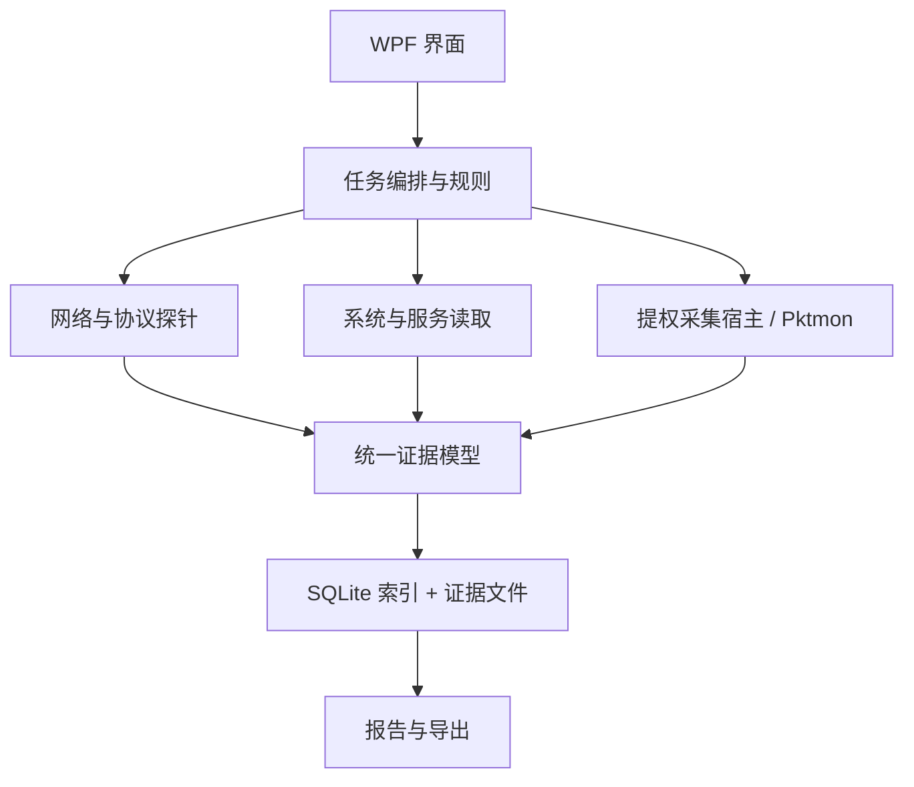
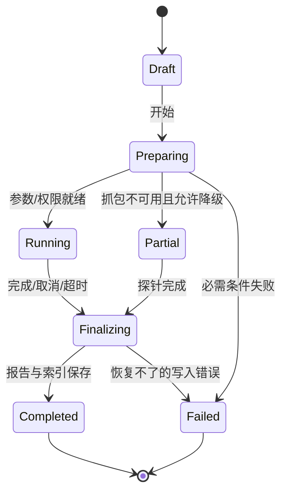

# NetFlow 完整产品设计与技术实施方案 v1.0

> 日期：2026-09-23　｜　状态：可实施设计基线　｜　平台：Windows 桌面端　｜　UI 参考：《NetFlow-完整UI概念图-13页.zip》

## 0. 阅读说明与决策摘要

NetFlow 是面向企业 IT 工程师的**网络与服务诊断工作台**。用户从一个客户端或服务器出发，选择目标与业务场景，执行本机环境检查、DNS、路径、TCP/UDP、应用协议、抓包、服务及事件检查，最后得到附有证据的结论与可分享的诊断包。

**产品验收核心：** 从填写目标到导出报告构成完整闭环。每个结果必须标注测试视角、观察事实、结论等级、证据来源、限制和下一步；不能把发送成功等同 UDP 端口开放，不能把本机无响应等同防火墙丢包，不能把端口可连接等同服务可用。

**实施决策：** .NET 10 LTS、WPF/MVVM、分层 C# 核心库、Windows 原生网络 API、Pktmon 抓包、Microsoft.Data.Sqlite 记录元数据、PCAPNG 原始证据、HTML/JSON/CSV 报告。TShark 为用户自行安装后的可选深度解码器。首版不要求后台服务、云端账户或 Npcap。

**范围原则：** “完整覆盖”指产品在网络与服务排障中的能力版图和每个已交付功能的输入到报告闭环；并非声称能分析所有协议、绕过加密、无凭据读取远端配置，或从单端抓包推断所有网络设备的行为。

## 1. 用户、场景与目标

### 1.1 用户与任务

| 用户 | 核心任务 | 主要输出 |
|---|---|---|
| 企业 IT / AD / Exchange 工程师 | 域控、邮件、认证、复制、DNS、RPC 故障定位 | 按角色执行的检测记录与抓包证据 |
| 网络管理员 | 判断出站、回程、ACL、路由与本机丢包问题 | 源/目的、时间、五元组、抓包和路径证据 |
| 应用 / 数据库工程师 | 区分端口、TLS、HTTP、SQL 实例、服务状态问题 | 服务级响应、错误码与依赖链 |
| 一线支持 | 按模板采集并移交问题 | 可复现任务、精简结论和脱敏报告 |

### 1.2 典型路径

1. **快速测试：** 输入 IP/域名 → 选源网卡、协议和端口 → 开始 → 看阶段结果 → 展开证据 → 导出。
2. **场景诊断：** 选“客户端访问 DC / Exchange 邮件流”等模板 → 核对角色与目标 → 执行带条件依赖的检查 → 关联抓包与服务事件 → 得到结论。
3. **故障复现：** 设过滤器与时间上限 → 开始抓包 → 手工复现或自动测试 → 停止 → 会话与异常分析 → 导出 PCAPNG 和报告。
4. **持续观察：** 创建任务 → 设置频率/采样/留存 → 观察异常时间段 → 点击一次异常打开对应测试证据。
5. **远端服务调查：** 先测网络 → 使用已有 Windows 权限查询服务/日志 → 按时间关联；权限不足时明确记录“未检查”及原因。

### 1.3 成功指标

| 指标 | 首版目标（上线后实测校准） |
|---|---|
| 单目标常见诊断 | 90% 的预设任务在 60 秒内完成，受目标超时与网络环境影响除外 |
| 结果可追溯率 | 100% 结果可展开参数、时间、来源与观察证据；证据缺失时标记缺失 |
| 抓包生命周期 | 任务完成、取消、崩溃恢复后能识别并处理遗留抓包会话 |
| 任务可复现率 | 100% 报告保留模板版本、源端、解析目标、配置及检查顺序 |
| UDP 误判 | 自动结论中绝不使用“无响应＝关闭/被防火墙阻断” |

## 2. 产品边界与运行模式

### 2.1 两类能力

| 模式 | 无管理员权限 | 管理员权限 / 远端权限 |
|---|---|---|
| 标准模式 | DNS、Ping、TCP/UDP、HTTP/TLS、路径探测、公开可读的本机信息、报告 | 某些系统配置和日志只能有限展示 |
| 抓包模式 | 可以导入现有 PCAPNG 分析 | 启动 Pktmon 抓包需要本机管理员权限；经确认后提升单次操作 |
| 远端服务模式 | 仍可执行网络侧检查 | 服务与事件查询取决于目标权限、相关服务、网络策略；无法访问时不推测状态 |

主程序默认以普通用户运行；**抓包通过独立提升权限的本机采集宿主**实现，交互时展示权限请求与采集范围。宿主只接受经过校验的采集参数，按任务 ID 写入限定工作目录；主程序通过受限本机 IPC 控制开始/停止，避免把所有 UI 和协议探针置于管理员权限下。MVP 可先用一次性提升的子进程实现，后续评估常驻服务。

### 2.2 支持环境

- 首发 Windows 11 x64 与 Windows Server 2022/2025 x64；Windows 10、Server 2019 等按兼容性实测列入支持矩阵。
- 支持 IPv4 和 IPv6；IPv6 链路本地地址必须指定作用域/网卡。
- 离线可用；无强制注册、云端、代理依赖。程序安装包自包含 .NET 运行时。
- 抓包能力按操作系统的 Pktmon 功能检测；缺失、被策略限制或提权失败时降级为纯网络测试与导入分析。
- 默认从**本机视角**观察；目标端视角只有导入其抓包/日志或启用将来正式发布的远端采集端才可提供。

## 3. 信息架构与 13 张 UI 基线

| 图号 | 页面 | 核心动作 | 关键状态/空态 |
|---|---|---|---|
| 01 | 场景诊断 | 目标 + 模板 → 执行 → 看证据 | 未运行/运行/完成/部分完成/取消 |
| 02 | 总览 | 快捷测试、最近任务、本机状态 | 无历史时引导新建任务 |
| 03 | TCP/UDP 快速测试 | 选择协议端口、源地址、超时 | 未确认、拒绝、超时分开显示 |
| 04 | 抓包分析 | 抓包/导入、过滤、会话、异常 | 无权限、抓包受限、文件损坏 |
| 05 | 服务与日志 | 查询状态、监听、关联事件 | 无远端权限/不支持时保留网络结果 |
| 06 | 历史报告 | 搜索、复查、重跑、导出 | 原始抓包已过期须提示 |
| 07 | DNS 解析 | 指定服务器、记录类型、比较 | NXDOMAIN/SERVFAIL/超时分别显示 |
| 08 | 路径与持续监测 | 路由、延迟、事件时间线 | 中间节点 ICMP 不回复不直接判断路 |
| 09 | HTTP/TLS 与服务协议 | 分阶段耗时、证书、握手 | TLS 验证失败不自动忽略证书 |
| 10 | 批量任务 | 导入目标、并发、矩阵、重试 | 局部失败不终止整批 |
| 11 | 本机网络与防火墙 | 网卡、路由、监听、规则 | 规则展示是配置证据，非有效路径证明 |
| 12 | 场景模板配置 | 编辑项目与条件、版本化 | 模板不适用时说明跳过条件 |
| 13 | 设置与抓包参数 | 采集范围、配额、留存、脱敏 | 管理员权限不可用时给出替代路径 |

UI 图均为视觉概念：图上的时间、IP、服务状态、证书和事件号不作为产品规则。正式实现需统一导航、图标、版本号、状态颜色与提示文字，所有字段由实际数据驱动。

### 3.1 交互规范

- 顶部始终显示“测试源/源网卡、目标、场景、开始/停止、抓包状态”；切换页面不停止正在执行的任务。
- 主区域采用概览表/时间线/细节侧栏。选中一条结果时保留所在任务、探针和证据关联，不混用不同测试结果。
- 状态词统一：**通过、警告、失败、未确认、未检查、跳过、已取消**。传输成功与业务通过分别判断。
- 所有耗时显示测试阶段及起止时间；无响应显示“—”，不显示伪造的 0 ms。
- 任何“原因”输出区分“观察事实”“可支持的推断”“尚待验证”。可复制一段诊断结论。
- 报告默认脱敏；PCAPNG 原始字节不承诺自动脱敏，导出前提供范围及文件大小预览。

## 4. 功能详细设计与闭环

### 4.1 本机网络画像

**输入：** 本机/网卡、目标地址（用于路径选择）、采样时间。**采集：** 适配器状态、MAC、IPv4/IPv6、前缀、网关、DNS、DNS 后缀、代理状态、路由、邻居缓存、TCP 连接和 UDP 端点、PID/进程、Windows 防火墙配置文件与规则。**结果：** 源地址/出口网卡选择、监听表、规则匹配候选、前后快照差异。**失败：** 权限不足或接口不可用逐项标记，不把缺失当正常。**验收：** 多网卡/VPN/IPv6 环境中，显示本次探针实际绑定地址，并与系统路由选择核对。

读取系统配置优先采用 .NET 网络信息 API 与 Windows 原生 API/PowerShell 官方模块；调用外部命令必须固定可执行文件路径、参数数组、超时、编码、退出码和版本解析。防火墙规则展示方向、配置文件、程序、服务、源/目标地址与端口；“有允许规则”不能直接证明真实流量被允许。

### 4.2 DNS 与服务发现

**输入：** 名称、类型 A/AAAA/PTR/CNAME/SRV/MX/NS/TXT/SOA、目标 DNS、UDP/TCP、递归开关、超时。**执行：** 并行向选定 DNS 发送真实查询，解析 RCODE、答案、TTL、CNAME 链、权威位；截断响应触发 TCP 重试并标识原因。**结果：** 每台 DNS 的准确应答与差异；AD SRV 模板支持站点相关记录。**失败：** 超时、SERVFAIL、REFUSED、NXDOMAIN、无应答、解析异常分别显示。**验收：** 两台 DNS 返回不同 A 记录时，不把任一方未经基线核对判定为错误。

指定 DNS 服务器和精确 DNS 报文字段需要协议探针或系统 `Resolve-DnsName` 适配器；`System.Net.Dns` 只用于系统默认解析及目标初步发现，不承担完整 DNS 记录比较。DNS over HTTPS/TLS 属于后续扩展项，不把系统代理/DoH 行为与直接 UDP 查询混为一谈。

### 4.3 连通、路径与端口

- **ICMP/路径：** 目标与 TTL 递增、每跳多个样本、延迟与抖动。中间跳无回复且终点可达时显示“此跳未回复”，不能据此定性丢包。路径选择展示源 IP、网卡、网关。
- **TCP：** 以目标解析地址和绑定源地址执行异步连接；区分连接成功、明确拒绝、超时、DNS 失败、本机套接字错误；每次记录连接耗时及目标 IP。TCP 可连接只证明传输层建立。
- **UDP：** 用具体协议请求确认服务响应；自定义文本/HEX 报文明确发送目标、编码、源端口、期望应答。已收到合法响应＝该请求得到服务响应；收到 ICMP 错误＝明确网络反馈；仅发送成功/超时＝未确认。部分 ICMP 错误可能受 OS 套接字行为和网络策略影响，日志记录观察来源。
- **批量：** 支持目标列表、端口/协议清单、并发上限、每项超时、重试、取消与只重跑失败；限制默认范围避免误操作和无意义超大批次。即使探测失败，仍可查看原始目标、解析过程与异常。

### 4.4 应用协议探针

| 探针 | 请求与响应 | 成功标准 | 可诊断边界 |
|---|---|---|---|
| DNS | RFC DNS 查询、事务 ID 匹配 | 返回合法响应且满足所选预期 | NXDOMAIN 等属于收到有效响应，但业务结果可能失败 |
| NTP | 合规客户端请求与服务端报文 | 模式/长度/来源合法，计算往返与时间偏差 | 不将单次偏差视为权威校时审计 |
| HTTP/HTTPS | HEAD/GET 可选、重定向、代理配置 | 用户定义可接受状态码与响应规则 | 401/403 表示 HTTP 服务响应，不代表业务可用 |
| TLS | 指定 SNI/主机名，校验证书链、名称、有效期、撤销策略 | 握手与指定验证条件通过 | 失败时不悄悄关闭证书检查 |
| SMTP | Banner、EHLO、可选 STARTTLS | 指定阶段返回期望响应 | 不发送邮件、不尝试认证，除非用户主动配置测试 |
| LDAP/LDAPS | 匿名/当前身份/提供凭据的 Bind、RootDSE | Bind/查询按照所选预期成功 | TCP 389 成功不代表 LDAP 身份验证成功 |
| SQL Server | UDP 1434 实例发现、返回端口 TCP、可选 TLS/认证 | 实例发现与数据库连接分步呈现 | 固定端口配置无需依赖 Browser |
| SMB | TCP 445 与可选 SMB 协商/共享访问 | 协商或指定资源访问成功 | 端口打开不代表共享权限成功 |
| RDP/WinRM/SSH | 端口及最小化服务握手 | 根据协议支持程度显示“握手成功” | 不声称登录或授权成功 |

协议探针按版本逐项实现；未实现的高级阶段只能显示“未支持/未检查”，不能用 TCP 端口结果冒充协议验证。敏感认证凭据不存明文，默认使用当前 Windows 身份；用户输入秘密以 Windows DPAPI CurrentUser 保护，并可设为仅本次使用。

### 4.5 抓包采集与分析

**采集：** 过滤目标 IP/协议/端口，用户指定网卡、时间、最大体积、截断长度；采集宿主记录原始 ETL、开始/停止时间、Pktmon 版本、过滤器和退出码，转换普通通信 PCAPNG 与单独的 drop-only PCAPNG。因 PCAPNG 不区分多层组件与丢包语义，ETL 必须作为高级诊断的可选保留证据；在报告里说明转换损失。**分析：** 导入 PCAPNG → 流/会话分组 → TCP SYN/SYN-ACK/RST/FIN、重传候选、DNS 请求应答、UDP 配对、TLS ClientHello/告警、ICMP 错误 → 关联测试阶段与源端日志。**导出：** 摘要 + 已选证据 + 原始 PCAPNG/ETL 可选。

Pktmon 可能记录同一流量在多个网络组件的观察，统计时按采集层次与去重键处理；不能简单把包数当线上唯一数据包数。TCP 重传识别采用相同流、序号范围、方向与时序等条件，标为“重传候选”并可核对原始包。TLS/SMB 等加密负载不默认解密。时间线上的“超时”是应用事件，不写作真实收到的数据包。

**权限/生命周期闭环：** 无管理员权限→说明并按需提升→采集启动失败时给出返回码→运行中状态可见→正常结束或取消时停止→转换失败时保留 ETL→下次启动检测遗留本工具任务并提示清理。禁止无界长时间全网卡全包捕获；可按任务设置留存和配额。已有外部抓包会话不得擅自停止；若系统工具存在独占冲突，明确提示并允许改用文件导入。

可选 TShark 仅调用用户已安装的可执行文件进行深层离线解析，做路径/版本检测和超时限制；不将其当默认抓包后端、不捆绑分发。可选 Npcap 后端需另做再分发与安装评估。

### 4.6 Windows 服务、事件与防火墙

**本机：** 服务名、状态、启动类型、PID、依赖、最近错误事件；关联进程监听端口和选中的防火墙规则。**远端：** 仅在已授权且通道可达时通过 SCM/CIM/事件日志接口读取，采集方式与使用身份写入报告；远端查询异常区分认证拒绝、端口不可达、功能禁用、超时。**策略：** 本产品默认只读，不在诊断页自动启动/停止服务、修改防火墙或清空日志。若未来加入修复操作，另建明确的确认和审计流程。

服务停止与网络探针超时仅可作为“相关证据”；若抓包来自客户端、服务状态来自服务器，需记录双方采样时间及偏差，绝不假定时钟完全一致。

### 4.7 场景模板

模板定义 `角色、目标类型、步骤、参数、依赖、条件、成功准则、建议、证据需求、最低权限、版本、来源`。内置模板只读，用户复制后编辑；修改不会重写历史报告，执行时固化模板快照。

| 场景 | 阶段与重要条件 |
|---|---|
| AD 客户端→DC | DNS SRV / A → Kerberos、LDAP/LDAPS、SMB、时间 → 可选认证；按业务启用所需端口 |
| DC→DC | DNS、RPC 135、实际动态 RPC、复制侧检查；复制健康需要管理员授权且不能由端口测试替代 |
| Exchange 客户端 | DNS、指定 URL、TLS、HTTP 响应、Autodiscover；实际命名空间和端口可编辑 |
| Exchange 邮件流 | MX、SMTP Banner/EHLO、STARTTLS、按源/目标角色确定方向 |
| SQL Server | 实例名→可选 Browser 1434→返回端口→TCP→可选 TLS/登录 |
| Web/API | DNS、代理/直连路径、TCP、TLS、HTTP 规则与时间分解 |
| SMB/文件共享 | DNS、445、可选 SMB 协商、共享权限按明确身份验证 |
| 远程管理 | WinRM、RDP、SSH 的连接与最小化握手 |
| NTP | 指定多台时间源、有效响应、往返与偏差对比 |

模板必须按“客户端→服务端”等方向标注。AD、Exchange、SQL 不做“一键全部端口必开”的错误假设。

### 4.8 批量与持续监测

CSV 导入经字段校验、预览、去重；任务容量与并发限制可设。执行器按目标和协议分级限流，带取消令牌；一次失败不影响其他项目，按项目重试次数并指数退避。持续监测采用低频定时探针，休眠/断网后记录采样缺口而非当成目标故障；不在后台无限抓包。异常时按策略生成有限时长抓包，需权限且用户显式启用。关闭主窗口可选择保持后台或停止，托盘展示活动任务及退出确认。

## 5. 统一状态、规则和证据模型

### 5.1 类型化结果

```text
DiagnosisRun  id, scenarioSnapshot, sourceHost, sourceAddress, adapter,
              requestedTarget, resolvedAddresses, startUtc, endUtc, appVersion
ProbeRun      id, runId, probeType, parameters, startUtc, endUtc, state,
              transportOutcome, protocolOutcome, observation[], errorCode
Evidence      id, runId, probeId?, kind, sourceSide, capturedUtc,
              artifactPath?, packetIds?, eventIds?, contentHash, redactionLevel
Finding       id, runId, severity, observedFacts[], inference?, limitations[],
              nextSteps[], supportingEvidenceIds[], ruleVersion
Artifact      id, runId, format, absolutePath, size, sha256, retentionPolicy
```

时间存 UTC，展示本地时区；数据包时间与事件时间保留采样来源。结构化结果先于界面渲染和报告生成，避免 UI 文本成为唯一事实源。原始敏感载荷默认不进入 SQLite；存储摘要、路径与 SHA-256。

### 5.2 状态判定矩阵

| 观察 | 传输 | 协议 | 对外状态 |
|---|---|---|---|
| TCP 三次握手完成 | 成功 | 未执行 | “端口连接成功”，协议待检查 |
| TCP RST / 明确拒绝 | 明确拒绝 | 未执行 | 失败，并说明本机观察范围 |
| SYN 发出且超时 | 超时 | 未执行 | 未确认原因；不可直接归因防火墙 |
| UDP 有匹配合法应答 | 请求应答成功 | 按应答校验 | 通过或服务级错误 |
| UDP 无应答 | 请求发出 | 无法验证 | 未确认 |
| DNS 收到 NXDOMAIN | 有应答 | 名称不存在 | DNS 服务可响应、该查询业务失败 |
| HTTP 401 | TCP/TLS 可用 | HTTP 有应答 | 按预期规则判定，非网络断开 |
| 无权限查询远端服务 | 网络可能可达 | 未执行 | 未检查，不判服务停止 |

### 5.3 规则引擎约束

- 每条建议必须对应至少一个事实，单独记录推断、适用条件和反例。
- 一端抓包只能描述该端观察；若“客户端发 SYN，服务器抓包未见 SYN”，要核对时间、过滤器、采集网卡与丢包率后再缩小范围。
- 任一外部工具的退出码、权限和版本进入 `Evidence`；抓包与事件来源不可混写。
- 诊断规则可单元验证，模板规则版本与报告绑定。

## 6. 技术栈与架构

| 层 | 选型 | 理由及替代条件 |
|---|---|---|
| UI | .NET 10 LTS + WPF + MVVM + 设计系统资源字典 | Windows 密集数据表格/树/多窗格成熟，易复现 13 张布局；需要强制 WinUI 风格时后续可替换 UI，不重写核心 |
| 探针核心 | C# 类库，async/await、CancellationToken、Socket/UdpClient/HttpClient/SslStream | 可控超时、可测试、可复用到 CLI/远端代理 |
| LDAP | System.DirectoryServices.Protocols | 支持可配置 Bind 与 LDAP 操作 |
| 抓包 | Pktmon 适配器 + 提权采集宿主 | Windows 内置，可导出 PCAPNG；高级事件保留 ETL |
| 解析 | 自有小范围协议解析器 + 可选 TShark 离线解码 | 常见协议自主可控，复杂协议借成熟工具，不捆绑 |
| 系统状态 | Windows API、NetTCPIP/NetSecurity、SCM、Event Log | 使用系统权威数据源，逐项处理权限差异 |
| 本地数据 | Microsoft.Data.Sqlite + 迁移、单写队列；原始证据独立文件 | 本机查询与索引足够；避免将大 PCAP 存 BLOB |
| 日志 | Microsoft.Extensions.Logging + 滚动文件/结构化事件 | 出错可追踪，默认不记录凭据与完整敏感载荷 |
| 导出 | 模板化离线 HTML、JSON Schema、CSV、证据 ZIP | 报告便于阅读，JSON 便于机器处理，PCAPNG 单独复核 |
| 发布 | Windows x64 自包含安装包；可选便携 ZIP | 安装即用，按组织政策适配签名与升级 |

### 6.1 模块和数据流



### 6.2 项目结构

```text
src/NetFlow.Desktop/             WPF 页面、控件、MVVM
src/NetFlow.Application/         任务编排、状态机、模板、报告用例
src/NetFlow.Domain/              结果、证据、规则、接口
src/NetFlow.Probes/              DNS/TCP/UDP/ICMP/HTTP/TLS/协议探针
src/NetFlow.Windows/             网卡、路由、防火墙、服务、事件适配
src/NetFlow.Capture/             会话分析、PCAPNG、Pktmon 协调
src/NetFlow.CaptureHost/         按需提权本机抓包宿主
src/NetFlow.Persistence/         SQLite、迁移、文件与留存
src/NetFlow.Reporting/           HTML/JSON/CSV/证据 ZIP
tests/NetFlow.*.Tests/           协议夹具、状态矩阵、报告契约
```

**技术取舍：** WinUI 3 也支持新式界面，但本产品数据表格、窗口组织与桌面系统集成较多，WPF 的交付风险较低。.NET 10 具备 LTS 支持，WPF 在该版本继续更新。SQLite 的 Microsoft.Data.Sqlite 异步方法底层可能同步执行，因此数据库操作走短事务与受控单写队列，不把大文件操作放在 UI 线程。详见附录官方文档。

## 7. 任务执行、持久化与异常恢复

### 7.1 任务状态机



取消、崩溃、磁盘满和系统休眠均要留存部分结果并标记终止原因。任务运行时定期写检查点；重启后只读扫描未结束任务，恢复报告索引并提醒用户处理残留采集会话。报告生成失败不删除已采集证据，可重试导出。

### 7.2 存储与留存

- SQLite 保存任务、探针、发现、模板快照、证据元数据与导出记录；数据库迁移有版本号、回滚备份和完整性检查。
- ETL/PCAPNG/JSON 按 `runId` 目录存储；临时文件原子重命名；校验 SHA-256、大小和可解析性。
- 默认 30 天/容量上限可配置，自动清理先显示估计释放量与受影响报告；用户标记“保留”不自动删。
- 报告索引保留但原始抓包过期时明确显示“证据文件已清理”；不会在报告里留下失效下载按钮。
- 项目日志与数据文件分开；配置支持导入/导出但不包含凭据。

### 7.3 外部命令与依赖隔离

Pktmon、TShark、系统命令使用 `ProcessStartInfo.ArgumentList`，避免命令行拼接；限定可执行文件路径、工作目录、可取消进程树、输出大小和执行时间。命令输出不作为唯一数据源，采用版本化解析器和退出码记录。发行时核对所有第三方包许可证与 NuGet 锁定版本；构建生成 SBOM。

## 8. 安全、隐私与管理策略

1. 默认只读；端口检测不自动改变系统网络配置、防火墙、服务或域设置。
2. 采集前明确范围、持续时间、预计体积和提权原因；任务结束自动关闭本工具启动的捕获会话。
3. 默认报告脱敏：Authorization、Cookie、令牌、用户名、路径与可配置内网 IP；脱敏报告与原始抓包是不同产物。脱敏规则记录版本，导出预览可核查。
4. 本地凭据使用 DPAPI CurrentUser，绝不写入日志、JSON、HTML 或模板；认证失败提供清除/重输入口。
5. 模板和自定义探针提供速率、目标数量和超时上限；非标准大范围扫描需用户显式确认范围。
6. 远端事件/服务访问使用用户已有权限，无“万能代理”或隐式提权；查询权限缺失保留可移交的错误证据。
7. 抓包导出可能包含业务数据；显示文件大小、过滤范围、可选摘要与原始文件，避免把“报告脱敏”误认为 PCAPNG 已脱敏。

## 9. 报告契约

每份 HTML 报告包含：标题与任务 ID；源端/目标/目标解析结果；本地和 UTC 时间；应用/模板/规则版本；执行项目与参数；逐项事实/结论/限制/建议；证据索引与 SHA-256；权限及未检查项目；抓包过滤器、丢包统计、附件清单。HTML 完全离线可打开，内容均需 HTML 转义；JSON 有固定 schema 版本，CSV 仅用于表格摘要。ZIP 使用相对路径与清单文件，导入时做路径穿越校验。

**报告示例：**

> 观察事实：客户端 10.20.10.15 向目标 10.20.10.10:123/UDP 发出一条 NTP 请求，本次采集窗口内未见匹配的应答。判定：NTP 服务状态未确认。限制：仅有客户端视角；抓包范围与时钟可能影响观察。下一步：在服务端检查 Windows Time 状态并同步抓包，核对请求是否到达及回应是否发出。

## 10. 非功能要求和性能预算

| 类别 | 要求 |
|---|---|
| 响应 | 主窗口与任务列表操作流畅；探针运行、解析与导出不阻塞 UI |
| 并发 | 默认 8 个目标任务并发，可配置 1–32；每目标协议步骤受模板依赖约束 |
| 资源 | 采集默认环形限额 256 MB，单任务最长 10 分钟；导入大文件流式解析并显示进度 |
| 可观测性 | 应用日志、探针错误码、外部命令版本、任务 ID、采集统计可关联 |
| 稳定性 | 进程崩溃/磁盘满/断网/休眠/目标切换均生成明确终态或可恢复部分结果 |
| 可访问性 | 键盘导航、高对比度、缩放 125–200%、颜色之外使用文字/图标区分状态 |
| 国际化 | 简体中文首发；状态与协议术语采用资源文件，日期按系统区域格式 |

这些数值是**设计目标**，需在真实 Windows 11、Windows Server、VPN、多网卡及大抓包样本上性能验证后修订。

## 11. 分阶段交付与验收

### M0：技术验证（正式实现前）

| 验证项目 | 通过条件 |
|---|---|
| Pktmon 采集 | 在目标 OS 上可限时/过滤采集、正常/异常停止、分别导出流量与丢包文件；记录权限失败路径 |
| DNS/NTP/TCP | 有效响应、超时、拒绝、错误报文的状态矩阵经真实与模拟目标验证 |
| 多网卡/IPv6 | 能明确本次真实源地址与解析目的 IP；链路本地地址处理正确 |
| 报告证据 | 一次任务的探针、时间线、PCAPNG、报告互相跳转且哈希一致 |
| 远端服务查询 | 有权/无权/防火墙阻断环境状态可靠区分 |

**若 M0 中某个 OS 的 Pktmon 不满足过滤或丢包记录需求，按 OS 能力矩阵降级；不虚构抓包能力。**

### M1：可发布的诊断闭环

总览、快速 TCP/UDP、DNS、ICMP/路径、NTP、HTTP/TLS；场景诊断基础框架；Pktmon 一键定向抓包与 PCAPNG 导出；基本会话/事件时间线；SQLite 历史；HTML/JSON/CSV 报告；管理员提权和异常恢复。**验收：** 从一个客户端对 DC 执行模板，失败时仍产生包含源端、目标、未检查项、原始包引用和限制说明的报告。

### M2：企业服务完整覆盖

LDAP/LDAPS、SMTP、SQL Browser 与实例连接、SMB 阶段检查；AD、Exchange、SQL、Web、共享等模板；本机服务/事件/监听/防火墙；可授权远端读取；批量任务和持续监测。**验收：** TCP 连接成功但服务停止、TLS 名称不符、SQL 实例发现成功但实例 TCP 失败，各自生成不同结论和下一步。

### M3：深度取证和工程化

高级包分析、双端抓包文件对比、可选 TShark 适配、自定义探针与模板版本管理、抓包留存策略、CLI 调用接口。**验收：** 双端样本能展示有依据的两侧观察与时钟/过滤限制，不给出越过证据的“防火墙确定丢包”结论。

**总工期估算：** 单人配合 AI 开发，M0 约 1–2 周，M1 约 5–8 周，M2 约 6–10 周，M3 约 5–8 周；这些是开发估算，不含企业环境协调、签名采购和长期兼容测试。首版不应因追求所有协议而推迟 M1 的完整诊断闭环。

## 12. 验收用例与质量门禁

| 用例 | 必须看到的结果 |
|---|---|
| UDP 端口无响应 | 已发送与未响应事实、状态未确认，不出现“端口关闭” |
| TCP 连接成功，HTTP 503 | 网络连接成功与应用返回 503 分层显示 |
| DNS 两服务器不同结果 | 两组原始应答、TTL、来源及差异，未知正确方 |
| 中间路由跳不回 ICMP，终点可达 | 中间跳未回复；目标可达 |
| TLS 证书名称错误 | 握手与名称验证分别记录，不忽略错误继续声称安全通过 |
| 无管理员权限开始抓包 | 提权说明；拒绝后仅执行普通探针并标记未抓包 |
| 抓包中取消/崩溃 | 停止或恢复处理采集任务，保留部分证据，无静默后台捕获 |
| 远端服务无权限 | 网络结果仍可用，服务查询为未检查并附权限错误 |
| 持续监测时睡眠 | 标记采样缺口，不计入目标丢包 |
| 原始抓包已按留存清理 | 历史报告仍可读，附件明确不可用 |
| 多目标部分失败 | 任务汇总与逐项结果保持一致，可只重跑失败项 |
| 证据敏感内容 | 报告脱敏成功，PCAPNG 导出清楚提示仍可能含原始内容 |

自动化测试集中在协议报文解析、状态判定、模板依赖、证据关联、导出契约、文件导入安全和任务恢复；抓包、提权与远端查询必须做 Windows 实机集成测试，不能只用 mock 代替。

## 13. 主要风险与工程决策

| 风险 | 具体影响 | 缓解/验收 |
|---|---|---|
| Pktmon 跨 OS 能力差异 | 过滤、组件与输出不一致 | M0 建 OS 能力矩阵，按功能检测和保留 ETL |
| Pktmon 需管理员权限 | 普通用户不能直接抓包 | 普通模式可用；采集宿主按需提权；允许导入文件 |
| 抓包加密/截断 | 无法读取应用负载 | 展示可观察 TLS/传输元数据；标记截断长度 |
| UDP/路径误判 | 错误归因 | 明确未确认状态，协议探针优先，规则契约测试 |
| 远端管理依赖权限/策略 | 服务与事件缺失 | 独立检查、分层结论、保留错误而不阻断网络检测 |
| 报告泄漏凭据/业务数据 | 敏感信息暴露 | 默认脱敏与导出预览；原始 PCAPNG 单独提示 |
| 大量目标导致网络/内存压力 | 应用卡顿或网络干扰 | 有界队列、并发限额、环形采集、流式文件处理 |
| UI 图数据不一致 | 开发误用视觉示例当业务逻辑 | 以本文件状态模型、协议契约和验收用例为准 |

## 14. 官方资料与选型依据（查阅于 2026-09-23）

1. [.NET 10 LTS 概览](https://learn.microsoft.com/en-us/dotnet/core/whats-new/dotnet-10/overview)；[WPF for .NET 10 更新](https://learn.microsoft.com/en-us/dotnet/desktop/wpf/whats-new/net100)。
2. [Test-NetConnection 能力说明](https://learn.microsoft.com/en-us/powershell/module/nettcpip/test-netconnection?view=windowsserver2025-ps)；[PortQry UDP 不确定状态](https://learn.microsoft.com/en-us/troubleshoot/windows-server/networking/portqry-command-line-port-scanner-v2)。
3. [Pktmon 功能概览](https://learn.microsoft.com/en-us/windows-server/networking/technologies/pktmon/pktmon)；[Pktmon 过滤器](https://learn.microsoft.com/en-us/windows-server/administration/windows-commands/pktmon-filter-add)；[ETL 转 PCAPNG 与丢包注意事项](https://learn.microsoft.com/en-us/windows-server/administration/windows-commands/pktmon-etl2pcap)；[管理员权限要求](https://learn.microsoft.com/en-us/windows/win32/pktmon/packetmonitor/nf-packetmonitor-packetmonitorinitialize)。
4. [Nmap 对 UDP open|filtered 的定义](https://nmap.org/book/scan-methods-udp-scan.html)；[TShark 手册](https://www.wireshark.org/docs/man-pages/tshark.html)；[Npcap 对外再分发许可](https://npcap.com/oem/redist)。
5. [Windows 网络配置](https://learn.microsoft.com/en-us/powershell/module/nettcpip/get-netipconfiguration?view=windowsserver2025-ps)；[本机 TCP 连接](https://learn.microsoft.com/en-us/powershell/module/nettcpip/get-nettcpconnection?view=windowsserver2025-ps)；[UDP 端点](https://learn.microsoft.com/en-us/powershell/module/nettcpip/get-netudpendpoint?view=windowsserver2025-ps)；[防火墙规则](https://learn.microsoft.com/en-us/powershell/module/netsecurity/get-netfirewallrule?view=windowsserver2025-ps)。
6. [Windows 服务查询](https://learn.microsoft.com/en-us/windows-server/administration/windows-commands/sc-query)；[远端事件日志](https://learn.microsoft.com/en-us/powershell/module/microsoft.powershell.diagnostics/get-winevent?view=powershell-7.5)。
7. [AD 防火墙端口按场景区分](https://learn.microsoft.com/en-us/troubleshoot/windows-server/active-directory/config-firewall-for-ad-domains-and-trusts)；[Exchange 客户端和邮件流端口](https://learn.microsoft.com/en-us/exchange/plan-and-deploy/deployment-ref/network-ports)；[SQL Browser UDP 1434](https://learn.microsoft.com/en-us/sql/database-engine/configure-windows/sql-server-browser-service-database-engine-and-ssas?view=sql-server-ver17)。
8. [.NET SslStream](https://learn.microsoft.com/en-us/dotnet/api/system.net.security.sslstream.authenticateasclient?view=net-10.0)；[LDAP 连接](https://learn.microsoft.com/en-us/dotnet/api/system.directoryservices.protocols.ldapconnection?view=net-10.0-pp)；[Microsoft.Data.Sqlite 概览](https://learn.microsoft.com/en-us/dotnet/standard/data/sqlite/)；[SQLite 异步限制](https://learn.microsoft.com/en-us/dotnet/standard/data/sqlite/async)。

---

**最终产品判断：** NetFlow 的第一竞争力是将“探针结果、抓包事实、服务事件、判断限制和下一步”落在同一个诊断任务里。先通过 M0 验证 Windows 抓包与远程读取的边界，再交付 M1 的端到端诊断闭环，逐步扩展到完整企业服务场景。
